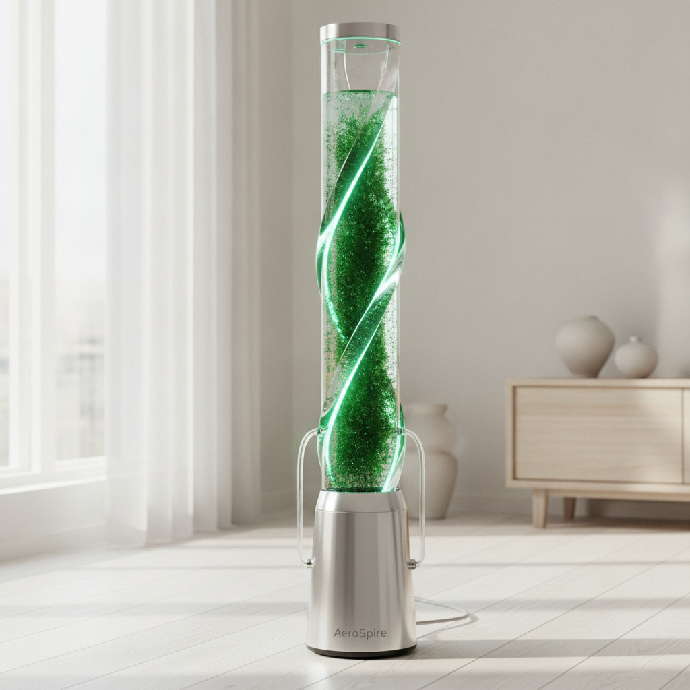

# Pitch Deck Summary: AeroSpire

# AeroSpire

## 🚀 Elevator Pitch
AeroSpire is a sleek, biotech-driven air purification column that harnesses the natural power of living micro-algae to deliver the oxygenating strength of twenty-five houseplants in a stunning, low-maintenance sculptural design.

## 📄 Product Overview
* **Algae-Powered Bioreactor:** Utilizes active micro-algae to aggressively consume carbon dioxide and release fresh, oxygenated air in real-time, operating with the efficiency of a mini-forest inside your home.
* **Smart & Silent Engineering:** Features automated nutrient self-dosing and ultra-quiet magnetic-drive aeration, ensuring peak biological performance with zero hassle.
* **Interactive Air Quality Indicator:** Features integrated, bio-luminescent ambient lighting that shifts in intensity to provide a beautiful, real-time visual representation of your indoor air quality.

## 📊 The Ask
We are seeking **$750,000** in exchange for **12.5% equity** (implying a $6.0M post-money valuation) to fund our initial production run, scale our proprietary bioreactor manufacturing, and launch our direct-to-consumer marketing campaign.
