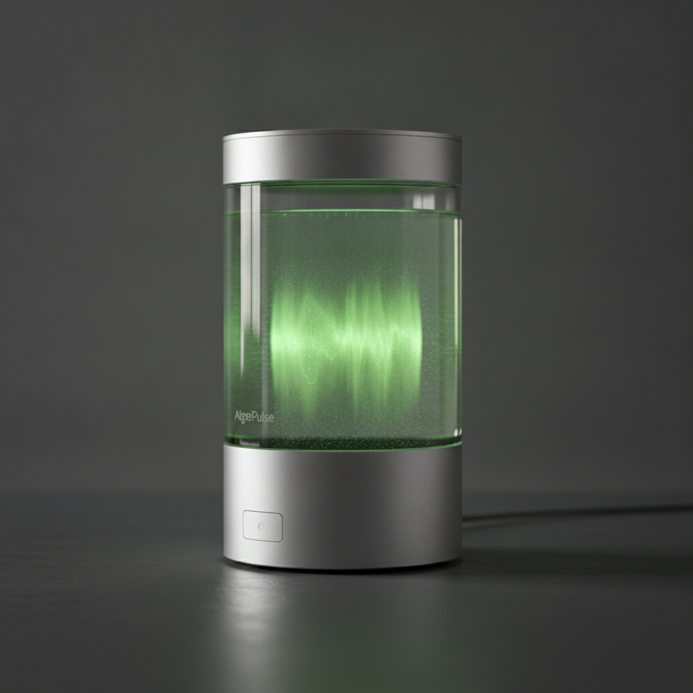

# Pitch Deck Summary: AlgaePulse

# AlgaePulse

## 🚀 Elevator Pitch
AlgaePulse is a category-defining biotechnology consumer product that merges high-end industrial design with proprietary bioreactor tech to purify indoor air 15x more effectively than traditional HEPA filters, while doubling as a circadian-aligned bioluminescent smart light.

## 📄 Product Overview
* **Hyper-Efficient Biotech Purification:** Utilizing a proprietary bioreactor filled with engineered, bioluminescent microalgae, AlgaePulse actively neutralizes carbon dioxide, VOCs, and particulate matter at 15 times the efficiency of market-standard HEPA filters.
* **Circadian Smart Lighting:** Harvests the natural bioluminescence of living algae, dynamically modulating intensity and hue to align with the user's natural circadian rhythm for improved wellness and sleep quality.
* **Premium, Frictionless Design:** Enclosed in an elegant borosilicate glass and recycled aluminum chassis, featuring an entirely silent electromagnetic induction pump and automated nutrient dispensing for a hands-off, premium user experience.

## 📊 The Ask
We are seeking a **$1,250,000** seed-stage investment in exchange for **8.5% equity** (implying a $14.7M post-money valuation). Capital will be deployed to finalize automated assembly manufacturing, secure our bio-safety supply chain, and launch our D2C go-to-market campaign targeting the rapidly growing $20B+ premium home wellness and air purification market.
